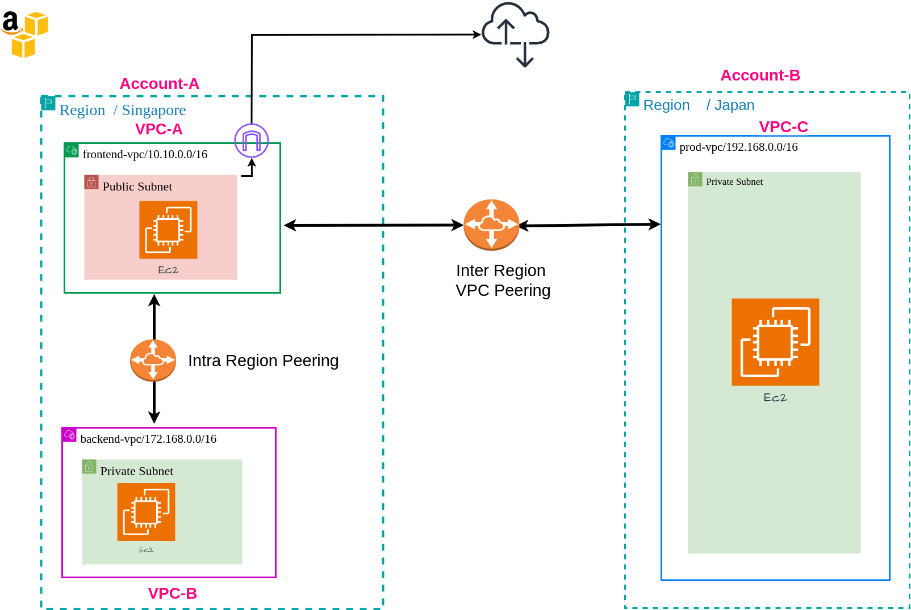
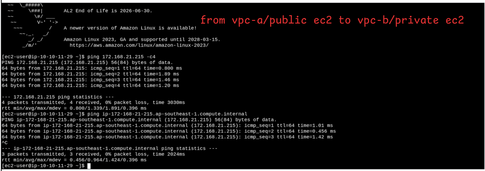
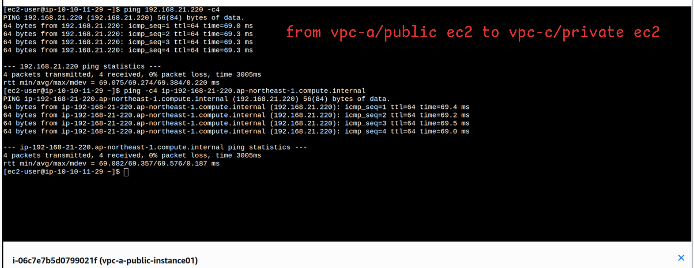

# VPC Peering – Same Account, Same Region, and Cross-Account Cross-Region

By default, AWS VPCs are isolated from each other, meaning resources in one VPC cannot directly communicate with resources in another. However, in many many real-world scenarios, applications or services deployed across multiple VPCs—whether in the same account, across different accounts, or even across regions—need to communicate privately and securely.

VPC Peering solves this by establishing a private network connection between VPCs. With peering, traffic flows over the secure AWS backbone instead of the public internet, improving both security and latency.

### Lab Scenario

In this lab, I will create a three-VPC architecture to explore both same-account and cross-account cross-region VPC peering.

- VPC-A and VPC-B → Same AWS account, same region

- VPC-C → Different AWS account, different region

Goal: Establish VPC peering connections between these VPCs to enable secure, private communication across same-account and cross-account environments.

---

## Architecture



---
***Note :*** VPC Peering does not support transitive peering. If VPC A is peered with VPC B and C , VPC B cannot communicate with VPC C through VPC A.

***Expected Result***

At the end of this lab:

From the public EC2 instance in VPC-A, you will be able to communicate (via ICMP or hostname resolution) with the EC2 instances running in the private subnets of VPC-B and VPC-C.

---

## Prerequisites
- AWS account(s) with IAM credentials configured
- Terraform `>= 1.0`

---

## Provider Configuration

```hcl

provider "aws" {
  # Configuration options
  profile = "account-A"
  region  = "ap-southeast-1"
  alias   = "account-A"
}

provider "aws" {
  # Configuration options
  profile = "account-B"
  region  = "ap-northeast-1"
  alias   = "account-B"
}

```
--- 
## Deployment Steps

### Clone Repository

```bash

git clone git@github.com:TunNyein/aws-vpc-peering-crossregion-crossaccount.git
cd aws-vpc-peering-crossregion-crossaccount.git

```
## Configure Variables

- Update terraform.tfvars with your desired configuration.

```bash

# Initialize Terraform
terraform init


# Review planned changes
terraform plan

-----
# Deploy infrastructure
terraform apply -auto-approve


```
---


## Verification

- SSH into the public EC2 instance.

```bash
ssh -i hub-ssh-key.pem ec2-user@<public-ec2-public-ip>

```

2. Test connectivity to private EC2 instances across peered VPCs:

- 

- 


Don’t forget to **destroy your infrastructure after testing** to avoid unnecessary AWS charges.

```bash

terraform destroy -auto-approve


```
---

Thank You